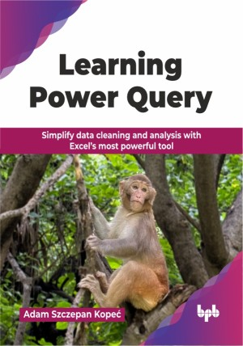

# Learning Power Query

Simplify data cleaning and analysis with Excel’s most powerful tool.

This is the repository for [Learning Power Query
](https://bpbonline.com/products/learning-power-query?_pos=1&_sid=021198cf2&_ss=r&variant=44749499138248?variant=44749499138248),published by BPB Publications.

## About the Book
In a time where data drives decision-making, Excel continues to be a vital resource for professionals. Power Query greatly enhances its functionality. As businesses increasingly seek automation and scalable solutions, proficiency in Power Query and the M language is a crucial advantage for data practitioners. This book fulfills that demand by combining technical accuracy with practical examples.

Beginning with basic transformations and progressing to advanced query logic, parameterization, and custom M solutions, each chapter fosters technical expertise. Readers will discover how to import data from diverse sources, enhance performance, troubleshoot queries, and tackle intricate business problems using clean and efficient M code. The book prioritizes clarity and control, providing alternative methods, performance optimization tips, and refined coding techniques throughout. 

By the end of the book, readers will be prepared to create Power Query workflows that extend well beyond the GUI. They will not only gain practical experience with the M language but also cultivate the ability to structure, refine, and optimize queries with accuracy, acquiring essential skills for automation and strategic data analysis.

## What You Will Learn
• Import data from Excel, folders, and various external sources.

• Transform, filter, and reshape data effectively.

• Develop dynamic parameters, lists, and filters driven by queries.

• Construct and repurpose custom M functions for use across different files.

• Apply techniques for ranking, aggregation, and custom sorting.

• Enhance query performance by employing clean and efficient M code.

• Automate complex transformations that exceed the capabilities of the GUI.

• Address business challenges using nested and recursive logic.
